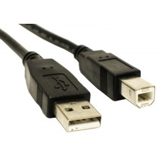

### What is Arduino?
Arduino is an open-source electronics platform based on easy-to-use hardware and software. It's intended for anyone making interactive projects.

### Do you have everything you need?
For this lesson you will need some stuff! Make sure you have this stuff or you will be unable to complete this lesson

* Assembled Arduino board, preferrably an Uno 

### Do you have everything you need?
* USB Cable. Standard A-B cable is required. Any length is OK

3. 9V DC power plug with 2.1mm barrel plug, positive tip (*Optional*)
4. Install Arduino IDE from [here](https://www.arduino.cc/en/Main/Software) to your laptop/desktop
5. Install Arduino driver for your OS of choice