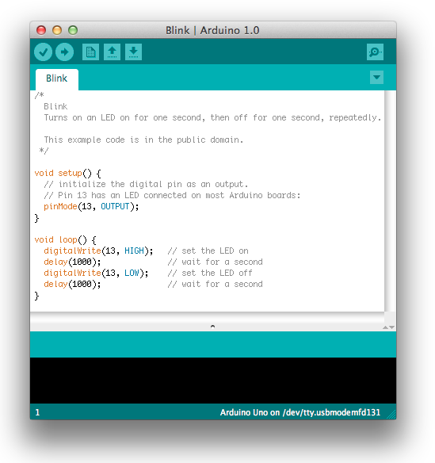
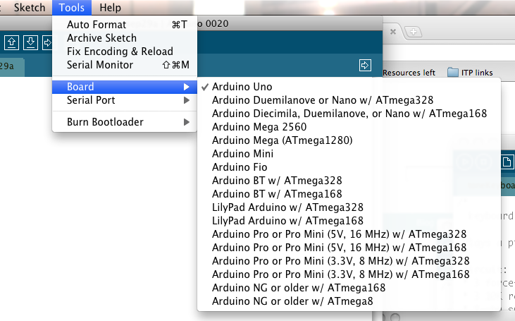

### Getting Started
#### Launch the Arduino application

Double-click the Arduino application (arduino.exe) you have previously downloaded . (Note: if the Arduino Software loads in the wrong language, you can change it in the preferences dialog. See the Arduino Software (IDE) page for details.)

#### Open the blink example

Open the LED blink example sketch: File > Examples >01.Basics > Blink.

#### Select your board

You'll need to select the entry in the Tools > Board menu that corresponds to your Arduino.

#### Select your serial port

Select the serial device of the Arduino board from the Tools | Serial Port menu. This is likely to be COM3 or higher (COM1 and COM2 are usually reserved for hardware serial ports). To find out, you can disconnect your Arduino board and re-open the menu; the entry that disappears should be the Arduino board. Reconnect the board and select that serial port.

#### Upload the program

Now, simply click the "Upload" button in the environment. Wait a few seconds - you should see the RX and TX leds on the board flashing. If the upload is successful, the message "Done uploading." will appear in the status bar. (Note: If you have an Arduino Mini, NG, or other board, you'll need to physically press the reset button on the board immediately before clicking the upload button on the Arduino Software.)

A few seconds after the upload finishes, you should see the pin 13 (L) LED on the board start to blink (in orange). If it does, congratulations! You've gotten Arduino up-and-running. If you have problems, please see the troubleshooting suggestions.